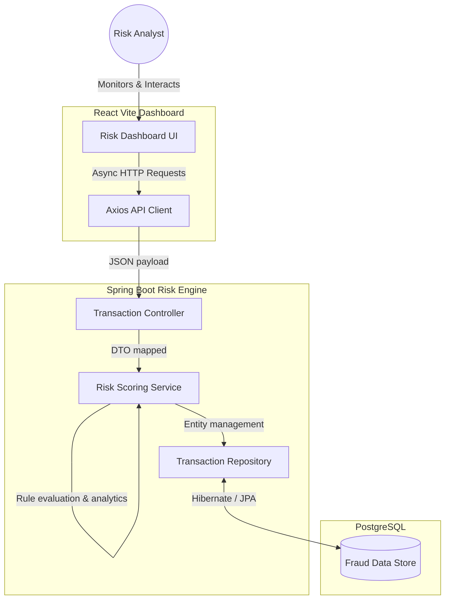

# 🛡️ Fraud Risk Analytics Engine

A comprehensive full-stack solution for detecting, analyzing, and mitigating fraudulent transactions in real-time. This project features a robust **Spring Boot** backend engine paired with a dynamic **React+Vite** frontend dashboard.

## 🏗️ Architecture & Dataflow

The system follows a modern decoupled architecture where the frontend client communicates seamlessly with the REST API backend, persisting data securely in a relational database.



## 💻 Tech Stack

### Frontend (`/risk-dashboard`)
- **Core:** React 19 + Vite
- **Styling UI:** Tailwind CSS v4
- **Icons:** Lucide React
- **Networking:** Axios

### Backend (`/risk-engine`)
- **Core:** Java 21 + Spring Boot 3.x
- **Modules:** Spring Web MVC, Spring Data JPA, Spring Validation
- **Database:** PostgreSQL
- **Utilities:** Lombok, Maven

## 📂 Repository Structure

```text
fraud-risk-analytics-engine/
├── risk-dashboard/      # React Vite Frontend Application
│   ├── src/             # Frontend source code (Components, API hooks)
│   └── package.json     # Node.js dependencies
├── risk-engine/         # Spring Boot Backend Service
│   ├── src/main/java/   # Java backend code (Controllers, Services, Repositories)
│   ├── src/main/res/    # Configuration files (application.properties)
│   └── pom.xml          # Maven build configuration
└── README.md            # Monorepo documentation
```

## 🚀 Getting Started

### Prerequisites
- **Node.js** (v18+)
- **Java JDK** (version 21 recommended)
- **PostgreSQL** Database instance
- **Maven** (optional, wrapper provided)

### 1. Running the Backend
1. Ensure your PostgreSQL database is running and credentials match the backend configuration.
2. Open a terminal and navigate to the backend directory:
   ```bash
   cd risk-engine
   ```
3. Run the Spring Boot application:
   ```bash
   mvn spring-boot:run
   ```
*The backend API will initialize and actively listen on `http://localhost:8080` (default).*

### 2. Running the Frontend
1. Open a new terminal split and navigate to the frontend directory:
   ```bash
   cd risk-dashboard
   ```
2. Install UI dependencies:
   ```bash
   npm install
   ```
3. Start the Vite development server:
   ```bash
   npm run dev
   ```
*The dashboard interface will spin up at `http://localhost:5173`. Open this URL in your browser to begin.*

---

## 🤝 Contributing
Contributions, issues, and feature requests are highly welcome! Feel free to check the issues page.
